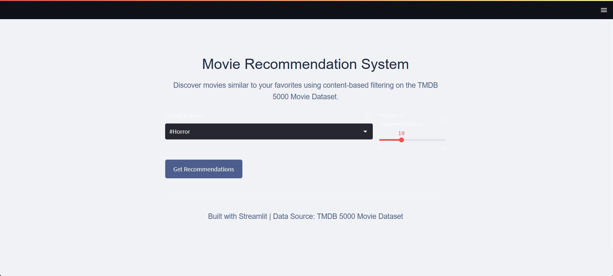
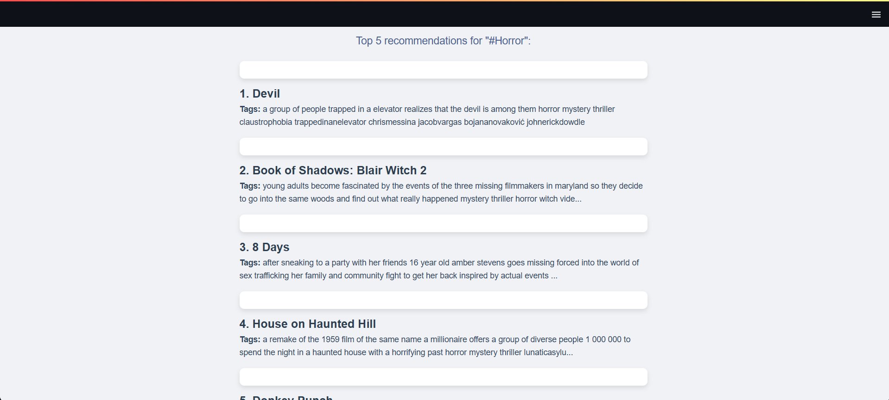

# Movie Recommendation System

This project is a **content-based movie recommendation system** built using **Streamlit** and the **TMDB 5000 Movie Dataset**.  
It allows users to discover movies similar to their favorites by analyzing movie metadata and applying cosine similarity on combined features such as genre, cast, crew, keywords, and overview.

---

## Features
- Content-based filtering using cosine similarity.
- Interactive web interface built with Streamlit.
- Adjustable number of recommendations.
- Recommendations displayed with movie title and tags.

---

## Dataset

The project uses the **TMDB 5000 Movie Dataset** available from Kaggle.  
Since the files are too large to upload, you can download them from the links below:

- [tmdb_5000_movies.csv](https://drive.google.com/file/d/1a16MlcdV2W-HHBYnC1JXkH3gxfVgiaxU/view?usp=sharing)  
- [tmdb_5000_credits.csv](https://drive.google.com/file/d/1rc5uTGqA7D1CSiyfP0fUTruZC2xQ_rK4/view?usp=sharing)

---

## Folder Structure

```

├── data/                      # Data files (can store preprocessed data or models)
├── demo/                      # Demo images/screenshots
│   ├── img1.png               # Screenshot of input interface
│   ├── img2.png               # Screenshot of recommendation results
├── app.py                     # Main Streamlit app file
├── Movie Recommendation System.ipynb  # Jupyter Notebook for preprocessing & modeling
├── movies.pkl                 # Preprocessed similarity matrix
├── README.md                  # Project documentation

````

---

## Screenshots

### Input Interface


### Recommendation Output


---

## How to Run

1. Clone the repository:
   ```bash
   git clone https://github.com/saradhapri/movie_recommendation_system.git
   cd movie_recommendation_system
   ````

2. Install required dependencies:

   ```bash
   pip install -r requirements.txt
   ```

3. Ensure the dataset files (`tmdb_5000_movies.csv`, `tmdb_5000_credits.csv`) are downloaded and placed in the correct path.

4. Run the Streamlit app:

   ```bash
   streamlit run app.py
   ```

---

## Built With

* Python
* Streamlit
* Pandas, NumPy
* Scikit-learn
* TMDB 5000 Movie Dataset

---

## Acknowledgements

* Dataset sourced from TMDB 5000 Movie Dataset (Kaggle).
* Inspired by content-based filtering techniques in recommender systems.

```

